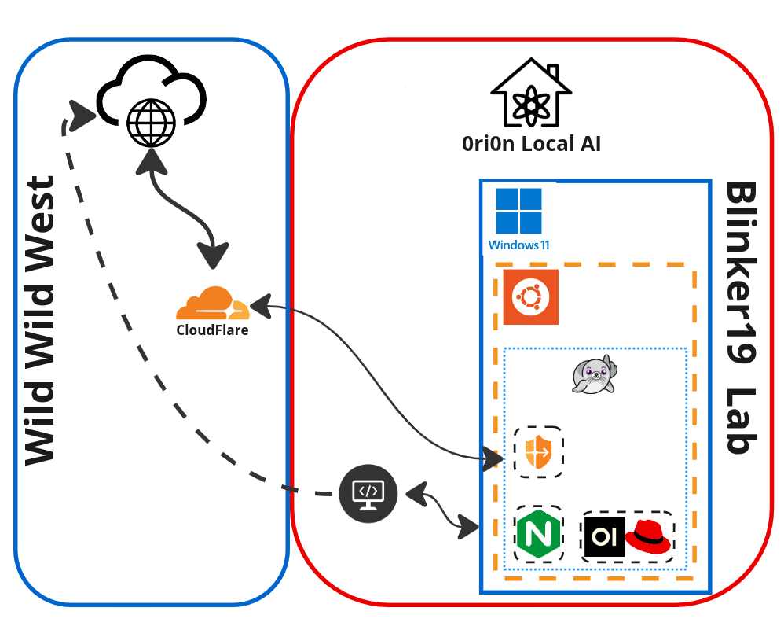

### Red Hat AI Inference Server (RHAIIS) with Open WebUI

With the recent announcement of Red Hat's new stand-alone [AI Inference Server](https://www.redhat.com/en/about/press-releases/red-hat-unlocks-generative-ai-any-model-and-any-accelerator-across-hybrid-cloud-red-hat-ai-inference-server), I wanted to test it out locally in my [Blinker19 Lab](https://r3dact3d.github.io/home%20lab/2025/01/19/orion-local-ai.html). I'm particularly interested in the **LLM Compressor capabilities** and seeing how increased the efficiency is between models. Red Hat AI Inference Server (RHAIIS) is a container image designed to **optimize serving and inferencing with Large Language Models (LLMs)**, with the ultimate goal to make it faster and cheapeer. It leverages the upstream **vLLM project**, which provides bleeding-edge inferencing features. It also uses **paged attention** to address memory wastage, similar to virtual memory, which helps lower costs.  Here is a blog that goes into more of a technical deep dive called [Introducing RHAIIS: High-performance, optimized LLM serving anywhere](https://www.redhat.com/en/blog/red-hat-ai-inference-server-technical-deep-dive).

<!--more-->

### Simple look into LLM Compressor

My initial interest in LLM Compressor was sparked by the promise of efficiency gains. Based on the [LLM Compressor Docs](https://docs.redhat.com/en/documentation/red_hat_ai_inference_server/3.0/html-single/llm_compressor/index), it is an **open source library** that incorporates cutting-edge research to leverage **quantization, sparsity, and general compression techniques** to improve generative AI model efficiency, scalability, and performance, while aiming to maintain accuracy. It integrates natively with Hugging Face and vLLM, and supports the `compressed-tensors` model format.

> It's important to note that LLM Compressor is currently designated as a **Developer Preview feature**.  It's provided for early access and feedback. 

Compression methodologies supported include:
*   **Quantization:** Converts model weights and activations to lower-bit formats like `int8` to reduce memory usage.
*   **Sparsity:** Sets a portion of model weights to zero.
*   **Compression:** Shrinks the saved model file size.

These methods can be used together for more efficient deployment on resource-limited hardware. LLM Compressor supports post-training quantization and integrates with Red Hat OpenShift AI for experimentation.

### Setting Up RHAIIS Locally

[Getting Started](https://docs.redhat.com/en/documentation/red_hat_ai_inference_server/3.0/html/getting_started/serving-and-inferencing-rhaiis_getting-started) with RHAIIS involves serving and inferencing an LLM using the container image. The prerequisites include having **Podman or Docker installed**, access to a **Linux server with NVIDIA or AMD GPUs** and necessary drivers (in my case, the NVIDIA drivers and NVIDIA Container Toolkit), access to `registry.redhat.io`, and a [**Hugging Face token**](https://huggingface.co/).

Current design of Blinker19 Lab serving RHAIIS via Open WebUI.


I am already serving LLMs with Ollama locally and integrated with Open WebUI to really get the most out of Ollama and to provide some LLMs as a service to friends and family. This means, I already had the NVIDIA drivers installed.  You can see more on that project on my blog at [Ori0n: My Local Private AI](https://r3dact3d.github.io/home%20lab/2025/01/19/orion-local-ai.html). 

 I found the instructions in the [RHAIIS Getting Started](https://docs.redhat.com/en/documentation/red_hat_ai_inference_server/3.0/html/getting_started/serving-and-inferencing-rhaiis_getting-started) documentation very straight forward.

The basic procedure involves:
1.  Logging into `registry.redhat.io`.
2.  Pulling the appropriate RHAIIS container image (e.g., `vllm-cuda-rhel9`).
3.  **Creating local cache volumes**: `mkdir -p rhaiis-cache/{flashinfer,huggingface,torch,vllm}`.
4.  **Setting permissions** for the cache volumes: `chmod a+rwX rhaiis-cache`.
5.  Creating or sourcing a file with your `HF_TOKEN`.
6.  Verifying GPU access using `nvidia-smi` within a test container.
7.  Running the RHAIIS container, specifying the model and necessary arguments

Outside of following these instructuctions, I did have two extra steps:
1. I manually create my Container Device Interface or CDI after installing the [NIDIA Container Toolkit](https://docs.nvidia.com/datacenter/cloud-native/container-toolkit/latest/install-guide.html)
```bash
$ sudo nvidia-ctk cdi generate --output=/etc/cdi/nvidia.yaml
$ nvidia-ctk cdi list
```
2. After creating the local directories to mount as volumes in the container and setting the permissions, I had to ensure recursive permisions
```
$ chmod -R a+rwX rhaai-cache/
```

### Validated Models and Quantization Options

While I am testing with a smaller 1B model, Red Hat provides a list of [**validated third-party models**](https://docs.redhat.com/en/documentation/red_hat_ai_inference_server/3.0/html-single/validated_models/index) for use with the inference server. These models are designed for efficient deployment on the Red Hat AI platform. The list includes models from families such as Llama, Mistral, Phi, Qwen, Gemma, and Granite.

Crucially, many of these validated models are available in **quantized variants**, including **INT4, INT8, and FP8**. These quantization levels offer different tradeoffs between model size, memory usage, performance, and accuracy. FP8 quantization, specifically, requires GPU hardware acceleration and is supported on specific NVIDIA (T4, A100, L4, L40S, H100, H200) and AMD (MI300X) GPUs.

These models can be accessed differently depending on whether you're using RHAIIS standalone (via Hugging Face images), as part of RHEL AI (via model OCI artifact images), or as part of OpenShift AI (via ModelCar images).


### Understanding Server Configuration

RHAIIS provides an **OpenAI-compatible API server**. Its behavior can be controlled using numerous server arguments when running the container. Some of the key arguments highlighted in the [vLLM Server Argurment documentation](https://docs.redhat.com/en/documentation/red_hat_ai_inference_server/3.0/html-single/vllm_server_arguments/index) include:

*   `--model`: Specifies the name or path of the Hugging Face model to use.
*   `--quantization` or `-q`: Specifies the method used to quantize the weights, with options like `awq`, `gptq`, `fp8`, `bitsandbytes`, and `compressed-tensors` .
*   `--gpu-memory-utilization`: Adjusts how much of the GPU memory is used for model weights, activations, and KV cache (default is 0.9, or 90%).
*   `--max-model-len`: Sets the maximum context length in tokens.
*   `--max-num-batched-tokens`: Limits the maximum batch size of tokens processed per step, impacting throughput and latency.
*   `--tensor-parallel-size`: Distributes the model across multiple GPUs .
*   `--served-model-name`: The name(s) the model will be known by in the API.
*   `--hf-token`: Provides the Hugging Face token for downloading models.

There are also many environment variables (prefixed with `VLLM_`) that can configure logging, caching, hardware-specific settings, and more.

Below you can see the output from starting Red Hat AI Inference Server.


Here we can see the model loaded and the Inference Server has started and the results of a few tests to validate the Inference Server is responding as expected.


### Evaluating Performance with Key Metrics

While I validated that the server was responding, the [Getting Started documentation](https://docs.redhat.com/en/documentation/red_hat_ai_inference_server/3.0/html-single/getting_started/index#validating-benefits-with-key-metrics_getting-started) provides context on how to evaluate LLM performance of Red Hat AI Inference Server. Key metrics include:

*   **Time to first token (TTFT):** How long until the first token is generated.
*   **Time per output token (TPOT):** How long it takes to provide each output token across users.
*   **Latency:** Total time for a complete response.
*   **Throughput:** How many output tokens can be produced simultaneously.

> A procedure is outlined to run a benchmark test using a vLLM script (`benchmark_serving.py`) to measure these metrics and compare performance, potentially against other inference servers.

### Troubleshooting Common Issues

Setting up and inference server can involve troubleshooting. The [Getting Started documentation](https://docs.redhat.com/en/documentation/red_hat_ai_inference_server/3.0/html/getting_started/troubleshooting_getting-started) has a troubleshooting section that covers common issues related to model loading, memory, networking, and GPU drivers.

*   **Model Loading Errors:** I would start by evaluating the GPU memory and the size of the LLM.  Specifically the context length as this can vary and can be reduce a lot of times for efficiency. 
*   For persistent issues, **enabling debug logging** by exporting `VLLM_LOGGING_LEVEL=DEBUG` is helpful to check detailed logs.

> Often, reducing the `--max-model-len` will help, unless you have a use-case that requires a very large context.

## Integrate Red Hat AI Inference Server with Open WebUI

As I mentioned before, I already have Open WebUI running and serving Ollama models, but now I want to take advantage of the super efficient models and features of Hugging Face and Red Hat.

Some of my friends, family, and some other hobby communities that I'm a part of are taking advantage of the **Knowledge Bank**, **Prompts**, **Tools** and behind the scenes RAG features of Open Web UI.

Since the Red Hat AI Inference Server follows the OpenAI API standards, the connection can be added in Open WebUI GUI Admin Panel > Settings > Connections

Red Hat AI Inference Server and Open WebUI are both running as containers on the same host, so configure the IP:port and token details.


In a new chat, I seleted the Red Hat model being served by the Red Hat AI Inference Server and asked a simple question for testing.


In the output from the infrerence server we can see the same chat comnpletion details along with the prompt for the chat.


### Connection Success and Future Plans

Success! Now I have a connection to Red Hat AI Inference Server and all the models my GPU can handle. This means, I can use my Knowledge, Tools, and Prompts already defined in Open WebUI with any Model being served by Red Hat AI Inference Server while also taking advantage of the features it has to offer.

Next, I plan to explore integrating RHAIIS as a node to enhance automation workflows in Ansible Automation Platform.

This journey has provided a valuable insight into the capabilities and technical considerations when deploying Red Hat AI Inference Server locally.
