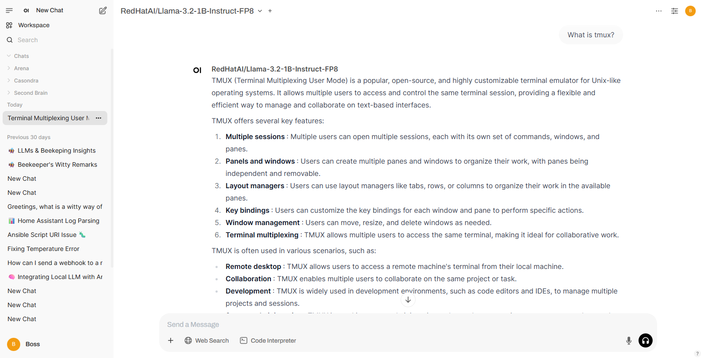

# Red Hat AI Inference Server

With the recent announcement of Red Hat's new stand-alone [AI Inference Server](https://www.redhat.com/en/about/press-releases/red-hat-unlocks-generative-ai-any-model-and-any-accelerator-across-hybrid-cloud-red-hat-ai-inference-server), I wanted to test it out locally in my [Blinker19 Lab](https://r3dact3d.github.io/home%20lab/2025/01/19/orion-local-ai.html).  I'm very interested in the LLM Compressor capabilities and see how increased the efficiency is between models.  Here is a blog that goes into more of a technical deep dive called [Introducing RHAIIS: High-performance, optimized LLM serving anywhere](https://www.redhat.com/en/blog/red-hat-ai-inference-server-technical-deep-dive).

I already have Ollama installed and running along with Open WebUI to really get the most out of Ollama and to provide some LLM as a service to friends and family, so I already had the NVIDIA drivers installed.  You can see more on that project on my blog at [Ori0n: My Local Private AI](https://r3dact3d.github.io/home%20lab/2025/01/19/orion-local-ai.html).   I found the instructions in the [RHAIIS Getting Started](https://docs.redhat.com/en/documentation/red_hat_ai_inference_server/3.0/html/getting_started/serving-and-inferencing-rhaiis_getting-started) documentation very straight forward. 

Outside of following these instructuctions, I did have two extra steps: <!--more-->
1. I manually create my Container Device Interface or CDI after installing the [NIDIA Container Toolkit](https://docs.nvidia.com/datacenter/cloud-native/container-toolkit/latest/install-guide.html)
```bash
$ sudo nvidia-ctk cdi generate --output=/etc/cdi/nvidia.yaml
$ nvidia-ctk cdi list
```
2. After creating the local directories to mount as volumes in the container and setting the permissions, I had to ensure recursive permisions
```
$ chmod -R a+rwX rhaai-cache/
```

Following the documentation, I was able to start the Red Hat AI Inference Server and started by testing with a smaller 1B model with a 2048 context length, just to be sure that size wasn't an issue.


Here we can see the model loaded and the Inference Server has started and the results of a few tests to validate the Inference Server is responding as expected.


## Open WebUI

Since the Red Hat AI Inference Server follows the OpenAI API standards, the connection can be added in Open WebUI GUI Admin Panel > Settings > Connections

Red Hat AI Inference Server and Open WebUI are both running as containers on the same host, so configure the IP:port and token details.


In a new chat, I seleted the Red Hat model being served by the Red Hat AI Inference Server and asked a simple question for testing.


In the output from the infrerence server we can see the same chat comnpletion details along with the prompt for the chat.


Success! Now I have a connection to Red Hat AI Inference Server and all the models my GPU can handle. This means, I can use my Knowledge, Tools, and Prompts already defined in Open WebUI with any Model being served by Red Hat AI Inference Server while also taking advantage of the features it has to offer.

Next, I plan on using the RHAIIS as a node to enhance my automation workflows in Ansible Automation Platform.


Sources: 

[Red Hat AI Inference Server Docs](https://docs.redhat.com/en/documentation/red_hat_ai_inference_server/3.0/)
[RHAIIS Getting Started](https://docs.redhat.com/en/documentation/red_hat_ai_inference_server/3.0/html/getting_started/serving-and-inferencing-rhaiis_getting-started)
[Introducing RHAIIS: High-performance, optimized LLM serving anywhere](https://www.redhat.com/en/blog/red-hat-ai-inference-server-technical-deep-dive)
[Nvidia CDI Support](https://docs.nvidia.com/datacenter/cloud-native/container-toolkit/latest/cdi-support.html)