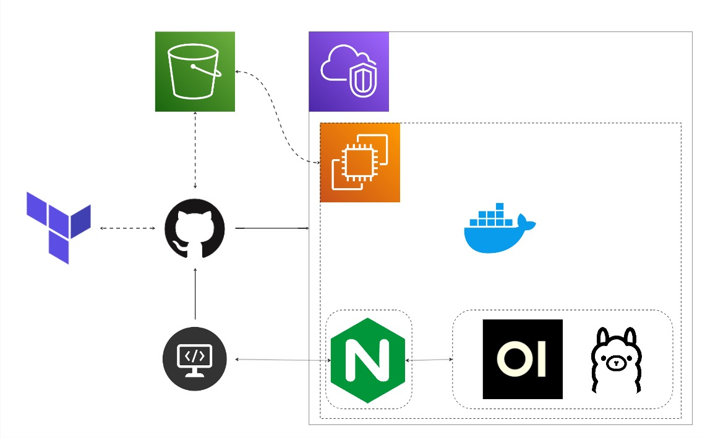
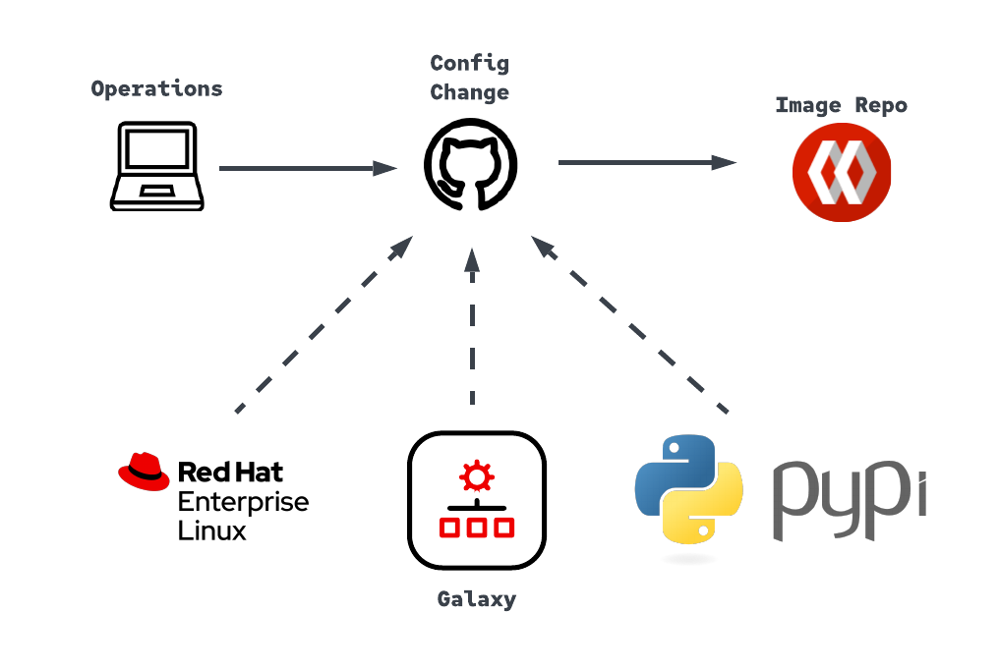

# Open Source

Hi, I’m Brady T, a Red Hat Architect with a passion for the outdoors and amateur radio. On this site, you’ll find a collection of my technical articles, blog posts, and other content.

## Featured Projects

Here are some of my notable projects:

### Project 1: Open WebUI with Ollama on AWS EC2 via Terraform

**Description:** This project leverages Terraform to provision infrastructure and integrates GitHub Actions for streamlined automation.

- **Technologies Used:** Terraform, RHEL, Podman, Ollama, Open WebUI, Nginx, AWS, Git
- 
- **Link to Project:** [Auto Intelligence](https://github.com/r3dact3d/Auto-Intelligence)

### Project 2: Execution Environment GitHub Workflow

**Description:** Automated Execution-Environment Builder for Ansible Automation Platform 2
- **Technologies Used:** GitHub Actions, Quay, Ansible, Git, Private Automatin Hub
- 
  
- **Link to Project:** [Ansible Execution Environment Stream](https://github.com/r3dact3d/Ansible-Execution-Environment-Stream)

## Latest Blogs

<ul>
  
    <li>
      <a href="{{ post.url }}">{{ post.title }}</a>
    </li>
  
</ul>

> [Blog Home](https://r3dact3d.github.io/posts)

## My Skills

I specialize in:
- Markdown: Efficiently managing notes and documentation.
- Git: Seamlessly tracking changes and collaborating with teams.
- Jinja2 Templating: Dynamically rendering content for dynamic web pages.
- VSCode Development: A powerful integrated development environment.

## Personal Interests

In my free time, I enjoy exploring various interests that enrich my life and inspire my work:

### Amateur Radio
I'm passionate about amateur radio (ham radio) and enjoy communicating with fellow enthusiasts around the world. It's a fascinating hobby that combines technology, communication, and community.

> [Link to qrz profile](https://www.qrz.com/db/W5AWW)

### Astrophotography
Stargazing and capturing the beauty of our universe through astrophotography is one of my greatest joys. Whether it’s the Milky Way or distant galaxies, I find peace in the cosmos.

### Beekeeping
Beekeeping connects me with nature and the intricate world of bees. It's a rewarding hobby that not only provides me with fresh honey but also helps support local ecosystems.

#### For the curious

* [Link to Second Brain project](https://r3dact3d.github.io/brain-dump/)

## Contact Me

Feel free to reach out via email or social media:

- **Email:** [brady.thompson@gmail.com](mailto:brady.thompson@gmail.com)
- **LinkedIn:** [www.linkedin.com/in/brady-thompson](https://www.linkedin.com/in/brady-thompson-redactedtech/)

